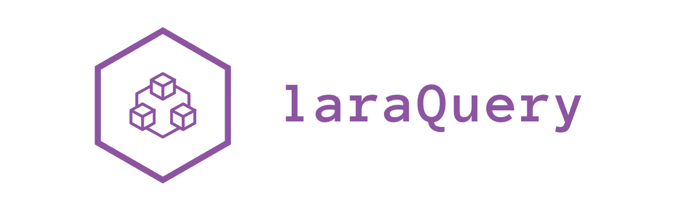

<p align="center"></p>

<p align="center">
<!-- <a href="https://travis-ci.org/laravel/framework"></a> -->


</a>
<br><a href="https://twitter.com/intent/follow?screen_name=okita_kamegoro"></a>
</p>

# LaraQurey- Automatically CLI Builder -


## Discripsion 

The LaraQuery is an MIT-license open source project with the launch of Laravel project using laradock is made too simply possible by CLI.

The LaraQuery takes the necessary `.env` settings just by answering a few questions and builds the Laravel environment immediately. 

- You just answer the question.
- You don't have to be troubled by the settings.


## Installation and Usage

To install and set up LaraQuery, run:

```bash 
git clone https://github.com/TanisukeGoro/laraQuery.git && cd $(basename $_ .git)

# or download from https://github.com/TanisukeGoro/laraQuery
bash install.sh

# If you can't use `laraquery` command then, run the following script
source ~/.bashrc
```

You will be able to run `laraquery` command that is to create laravel project.

> ※You will be able to run `laraquery` command that is to create laravel project.
> 
> If you can't use `laraquery` command then, run the following script: <br> 
> `source ~/.bashrc`


```bash
$ laraquery

 # Initialized empty Git repository in .....
 # Install Laradock from Github.....
 # Cloning into '/laradock'...
 # remote: Enumerating objects: 9065, done.
 # remote: Total 9065 (delta 0), reused 0 (delta 0), pack-reused 9065
 # Receiving objects: 100% (9065/9065), 8.31 MiB | 477.00 KiB/s, done.
 # Resolving deltas: 100% (4861/4861), done.
 # 
 #
 # Input Project Name
 # 1) laradock_test
 # 2) input my self
 # #? 1
 # 1 ) Project_Name
 #
 #
 # What Web Servers do you use?
 # 1) NGINX
 # 2) Apache2.x
 # 3) Caddy
 # #? 1
 # You selected
 # 1 ) NGINX
 #
 #
 # What Database Management Systems do you use?
 # 1) MySQL	3) MariaDBf	5) MSSQL	7) Neo4j	9) RethinkDB
 # 2) PostgreSQL	4) Percona	6) MongoDB	8) RethinkDB
 # #? 1
 # You selected
 # 1 ) MySQL
 # Creating network "laradock_test_frontend" with driver "bridge"
 # Creating network "laradock_test_backend" with driver "bridge"
 # ......
 # .....................
 ```

## Supported Software

※ Will be added sequentially in the next version

- Web Servers :
  - Nginx
  - Apache2 (✨New feature)
  <!-- - ~~Caddy~~ -->

- Database Management Systems:
  - MySQL
  - PostgreSQL
    - PostGIS (Postgres extension module (✨New feature))
  - ~~SQLite~~
  - ~~SQL Server(MSSQL)~~

- Database Management Apps:
  - PhpMyAdmin
  - PgAdmin
  - ~~Adminer~~


## Support Version Lists

We Support there versions as below:

| **Version** | **Release date**  | **PHP version** |
| :---------: | :---------------: | :-------------: |
|     5.4     | January 24, 2017  |     ≥ 5.6.4     |
|   5.5 LTS   |  August 30, 2017  |     ≥ 7.0.0     |
|     5.6     | February 7, 2018  |     ≥ 7.1.3     |
|     5.7     | September 4, 2018 |     ≥ 7.1.3     |
|     5.8     | February 26, 2019 |     ≥ 7.1.3     |
|   6.0 LTS   | September 3, 2019 |     ≥ 7.2.0     |


## Troubleshooting

If your web browser doesn't display well after launching the project, try the following command:

```bash
cd laradock
docker-compose exec workspace bash
composer install
php artisan key:generate
```

## Feature


## License
The LaraQuery is open-source software licensed under the MIT license.
